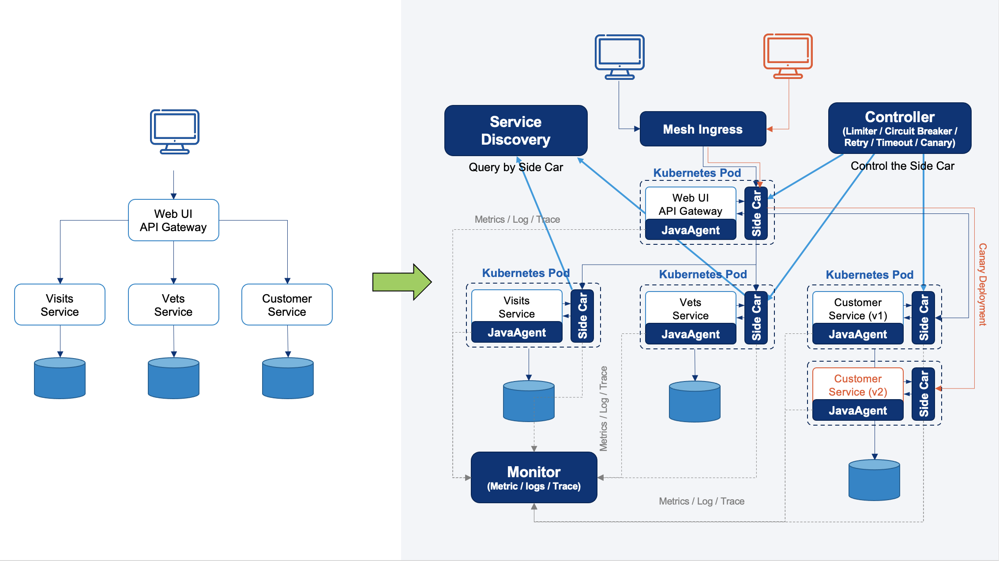
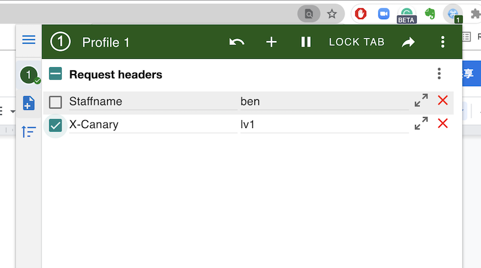

# EaseMesh

- [EaseMesh](#easemesh)
  - [1. 宗旨](#1-宗旨)
  - [2. 原则](#2-原则)
  - [3. 架构](#3-架构)
  - [4. 特点](#4-特点)
  - [5. 依赖项目](#5-依赖项目)
  - [6. 快速启动](#6-快速启动)
    - [6.1 环境要求](#61-环境要求)
    - [6.2 健全测试](#62-健全测试)
    - [6.3 安装](#63-安装)
  - [7. 示范](#7-示范)
    - [7.1 在EaseMesh中启动PetClinic](#71-在easemesh中启动petclinic)
      - [7.1.1 步骤1：应用网格配置](#711-步骤1应用网格配置)
      - [7.1.2 步骤2：创建命名空间](#712-步骤2创建命名空间)
      - [7.1.3 第四步：设置数据库](#713-第四步设置数据库)
      - [7.1.4 第三步：应用Ppetclinic栈](#714-第三步应用ppetclinic栈)
      - [7.1.5 获取`EaseMesh ingress`服务的暴露端口](#715-获取easemesh-ingress服务的暴露端口)
      - [7.1.6 第五步：配置反向代理](#716-第五步配置反向代理)
        - [7.1.6.1 通过Easegress配置反向代理](#7161-通过easegress配置反向代理)
        - [7.1.6.2 通过Nginx配置反向代理](#7162-通过nginx配置反向代理)
    - [7.2 金丝雀部署](#72-金丝雀部署)
      - [7.2.1 步骤1：流量着色](#721-步骤1流量着色)
      - [7.2.2 步骤2：应用EaseMesh的金丝雀配置](#722-步骤2应用easemesh的金丝雀配置)
      - [7.2.3 第3步：准备好应用程序的金丝雀版本](#723-第3步准备好应用程序的金丝雀版本)
      - [7.2.4 步骤4：建立canary图像](#724-步骤4建立canary图像)
      - [7.2.5 步骤5. 部署金丝雀版本](#725-步骤5-部署金丝雀版本)
      - [7.2.6 步骤6：发送着色流量](#726-步骤6发送着色流量)
    - [7.3 清理Demo](#73-清理demo)
  - [8. 路线图](#8-路线图)
  - [9. 贡献](#9-贡献)
  - [10. 许可证](#10-许可证)
  - [11. 用戶手冊](#11-用戶手冊)

EaseMesh是一个与Spring Cloud生态系统兼容的服务网格。它基于[Easegress](https://github.com/megaease/easegress)开发了Mesh的控制组件和流量边车，并且利用了[EaseAgent](https://github.com/megaease/easeagent)的服务监测，调用链追踪等特性。

<a href="https://megaease.com/easemesh">
    
</a>

## 1. 宗旨

为什么我们要重新发明一个轮子？

- **服务网与Spring Cloud生态系统兼容：** Spring Cloud生态系统中的微服务有自己的服务注册/发现组件。这与使用DNS进行服务发现的Kubernetes生态系统完全不同。主要的服务网格解决方案（如Istio）使用Kubernetes领域技术。但这样的方案会带来许多痛苦，且与Java Spring Cloud生态系统有冲突。EaseMesh旨在使Service Mesh与Java Spring Cloud完全兼容。

- **更细致的观察性：** 目前基于Kubernetes的服务网格只能看到入口/出口流量，它不知道服务/应用中发生了什么。因此，结合Java Agent技术，我们可以拥有观察服务/应用内部和外部的全部能力。

- **复杂的流量分割能力：** EaseMesh具有复杂的流量分割能力，它可以将一个请求链的流量分割到多个服务。这种能力可以应用于金丝雀部署、在线生产测试等场景。

> 简而言之，**EaseMesh利用Kubernetes sidecar和Java Agent技术，使Java应用具有服务治理和细致观察能力，而无需改变任何一行源代码**。

## 2. 原则

- **Spring Cloud兼容性：** Spring Cloud领域服务管理和弹性设计。
- **无需修改代码：** 使用sidecar和Java Agent来完成服务治理和综合观测。
- **服务监控：** 服务运行指标/跟踪/日志监控。

## 3. 架构


## 4. 特点

- **非侵入式设计** 对Java Spring Cloud应用程序的迁移不做任何代码修改，只需要进行小规模的配置更新。
- **Java注册/发现** 与流行的Java Spring Cloud生态系统的服务注册/发现兼容。
  - **多个租户（命名空间）** 支持多个租户的服务注册，隔离不同租户的服务。
  - **共享（全局）租户** 支持共享租户，所有服务对全局租户中注册的服务都有可见性。
  - **兼容性**
    - 与Eureka注册表兼容。
    - 与Consul注册表兼容。
    - 与Nacos注册表兼容。
  - **可扩展性** 支持用元数据注册服务。
- **资源管理** 依靠Kubernetes平台来管理CPU/内存资源。
- **流量编排**
	- **丰富的路由规则** 精确的路径、路径前缀、路径的正则表达式、方法、头部匹配。
  - **流量分割** 对东西向和南北向流量进行着色和调度到配置的服务。
  - **负载平衡** 支持Round Robin, Weight Round Robin, Random, Hash by Client IP Address, Hash by HTTP Headers。
- **弹性设计** 包括超时/断路/重选/限制器，完全遵循复杂的弹性设计。
	- **弹性和容错性**
		- **断路器** 暂时阻止可能的故障。
		- **速率限制器** 限制传入请求的速率。
		- **重选器** 重复失败的执行。
		- **时间限制器** 限制执行的时间。
  - **混沌工程**
    - **故障注入** 正在进行的工作。
    - **延迟注入** 工作正在进行中。
- **可观察性**
  - **日志**
    - **访问日志** 为每个服务的所有请求生成HTTP访问日志。
    - **应用日志** 自动将跟踪上下文注入到日志数据中。
  - **追踪**
    - **JDBC** 对JDBC的调用进行跟踪。
    - **HTTP请求** 对HTTP RPC的追踪。
    - **Kafka** 对Kafka传递的消息进行追踪。
    - **Redis** 追踪Redis缓存的访问。
    - **RabbitMQ** 跟踪由RabbitMQ传递的消息。
    - **采样**
      - 支持概率采样。
      - 支持 QPS 采样。
  - **指标**
    - **HTTP请求** 报告每个URL的吞吐量延迟。
    - **JDBC** 报告每个SQL的吞吐量和延时。
    - **Kafka** 报告每个消费者、生产者和主题的吞吐量和延时。
    - **Redis** 报告每个方法的吞吐量和延时。
    - **RabbitMQ** 报告每个主题的吞吐量和延时。
- **安全**
  - **mTLS** *Working in progress.*
  - **mTLS强制执行** *Working in progress.*
  - **外部CA证书** *Working in progress.*
  - **服务到服务的授权规则** *Working in progress.*

> 吞吐量由m1, m5, m15表示。
> 延迟由P99、P98、P95、P90、P80、P75、P50等表示。

## 5. 依赖项目

1. [EaseAgent](https://github.com/megaease/easeagent)
2. [Easegress](https://github.com/megaease/easegress)

## 6. 快速启动

### 6.1 环境要求

- Linux内核版本4.15以上
- Kubernetes版本1.18以上
- MySQL版本5.7+

### 6.2 健全测试

- 运行`kubectl get nodes`来检查你的Kubernetes集群是否健康。

### 6.3 安装

请查看 [install.md](./docs/install.md) 来安装EaseMesh。

## 7. 示范

- [Spring Cloud PetClinic](https://github.com/spring-petclinic/spring-petclinic-cloud) 微服务实例。

- 它使用了Spring Cloud Gateway、Spring Cloud Circuit Breaker、Spring Cloud Config、Spring Cloud Sleuth、Resilience4j、Micrometer和Spring Cloud Netflix技术栈的Eureka Service Discovery。



准备好`emctl`

```bash
git clone https://github.com/megaease/easemesh
cd emctl && make
export PATH=$(pwd)/bin:${PATH}.
```

### 7.1 在EaseMesh中启动PetClinic

#### 7.1.1 步骤1：应用网格配置

应用EaseMesh的配置文件

```bash
emctl apply -f https://raw.githubusercontent.com/megaease/easemesh-spring-petclinic/main/mesh-conf/a-pet-tenant.yaml
emctl apply -f https://raw.githubusercontent.com/megaease/easemesh-spring-petclinic/main/mesh-conf/api-gateway.yaml
emctl apply -f https://raw.githubusercontent.com/megaease/easemesh-spring-petclinic/main/mesh-conf/customers.yaml
emctl apply -f https://raw.githubusercontent.com/megaease/easemesh-spring-petclinic/main/mesh-conf/ingress.yaml
emctl apply -f https://raw.githubusercontent.com/megaease/easemesh-spring-petclinic/main/mesh-conf/vets.yaml
emctl apply -f https://raw.githubusercontent.com/megaease/easemesh-spring-petclinic/main/mesh-conf/visits.yaml
```

#### 7.1.2 步骤2：创建命名空间

利用kubectl来创建`spring-petclinic`命名空间

我们支持在你想要的命名空间中创建或更新Deployment时自动注入sidecar和JavaAgent。所以你需要创建一个有特定标签的命名空间，我们准备了一个spring-petclinic命名空间，你可以通过以下方式创建它。

```bash
kubectl apply -f https://raw.githubusercontent.com/megaease/easemesh-spring-petclinic/main/namespace/spring-petclinic.yaml
```

#### 7.1.3 第四步：设置数据库

Petclinic的演示需要访问数据库，默认的是内存数据库。但在EaseMesh快速启动中，你可以默认使用内存数据库。

>如果你想使用MySQL数据库，你可以创建DB表方案，并从[PetClinic范例](https://github.com/spring-projects/spring-petclinic/tree/main/src/main/resources/db/mysql)导入记录来设置你的数据库。

#### 7.1.4 第三步：应用Ppetclinic栈

将Petclinic资源部署到k8s集群，我们已经开发了一个[operator](./operator/README.md)来管理EaseMesh的自定义资源(MeshDeployment)。`Meshdeployment`包含一个K8s的完整部署规范和一个关于服务的额外信息。

> EaseMesh的操作者会自动向pod注入一个sidecar和一个JavaAgent到应用程序的JVM中。

现在，我们支持将JavaAgent和sidecar注入到本地部署中，但你需要通过注解的`mesh.megaease.com/service-name: "{service-name}"`在部署规格中明确指定服务名称。EaseMesh有一个[`admission control`](https://kubernetes.io/docs/reference/access-authn-authz/admission-controllers/)服务器，它将观察指定命名空间中的部署的创建/更新操作。如果一个带有`mesh.megaease.com/service-name`注解的部署是在特定的命名空间中创建的（附有key为`mesh.megaease.com/mesh-service`的label），准入控制服务将改变Deployment规格去注入sidecar和JavaAgent。

```bash
kubectl apply -f https://raw.githubusercontent.com/megaease/easemesh-spring-petclinic/main/deployments/01-vets.yaml
kubectl apply -f https://raw.githubusercontent.com/megaease/easemesh-spring-petclinic/main/deployments/02-visits.yaml
kubectl apply -f https://raw.githubusercontent.com/megaease/easemesh-spring-petclinic/main/deployments/03-customers.yaml
kubectl apply -f https://raw.githubusercontent.com/megaease/easemesh-spring-petclinic/main/deployments/04-api-gateway.yaml
```

> **注意**：在yaml文件中有一个ConfigMap，如果你想使用MySQL数据库，你需要根据你的环境改变它。

#### 7.1.5 获取`EaseMesh ingress`服务的暴露端口

```bash
kubectl get service -n easemesh easemesh-ingress-service
```

> **注意**：从输出中，你可能会注意到Ingress服务的暴露端口。如果你不需要使用反向代理服务，你可以通过http://{your_host}:{exposed_port}/直接访问Petclinic应用程序。

#### 7.1.6 第五步：配置反向代理

> **注意**：该步骤是可选的。如果你对反向代理没有要求，可以省略这一步。

##### 7.1.6.1 通过Easegress配置反向代理

> **注意**：仅适用于Easegress充当反向代理服务的场景

如果你利用[Easegress](https://github.com/megaease/easegress)作为反向代理服务，可以应用以下配置。

HTTP Server spec (file name: http-server.yaml):

```yaml
kind: HTTPServer
name: spring-petclinic-example
port: 443
https: true
keepAlive: true
keepAliveTimeout: 75s
maxConnection: 10240
cacheSize: 0
certs:
  key: {add your certs information to here}
rules:
  - paths:
    - pathPrefix: /
      backend: http-petclinic-pipeline
```

HTTP Pipeline spec (file name: http-petclinic-pipeline.yaml):

```yaml
name: http-petclinic-pipeline
kind: HTTPPipeline
flow:
  - filter: requestAdaptor
  - filter: proxy
filters:
  - name: requestAdaptor
    kind: RequestAdaptor
    method: ""
    path: null
    header:
      del: []
      set:
        Host: "{you host name, can be omitted}"
        X-Forwarded-Proto: "https"
        Connection: "upgrade"
      add:
        Host: "{you host name, can be omitted}"
  - name: proxy
    kind: Proxy
    mainPool:
      servers:
      - url: http://{node1_of_k8s_cluster}:{port_exposed_by_ingress_service}
      - url: http://{node2_of_k8s_cluster}:{port_exposed_by_ingress_service}
      loadBalance:
        policy: roundRobin
```

根据你的环境改变`{}`中的内容，并通过Easegress客户端命令工具`egctl`生效它。

```bash
egctl apply -f http-server.yaml
egctl apply -f http-petclinic-pipeline.yaml
```

> **egctl**是Easegress的客户端命令行。

使用`$your_domain/#!/welcome`访问PetClinic网站

##### 7.1.6.2 通过Nginx配置反向代理

> **注意**：只适用于Nginx充当反向代理服务的场景

如果你利用Nginx作为反向代理服务，应该添加以下配置。

然后将NodPort的IP地址和端口号配置到你的流量网关的路由地址中，例如，在Nginx中添加配置。

```plain
location /pet/ {
    proxy_pass http://{node1_of_k8s_cluster}：{port_exposed_by_ingress_service}/;
}
```

> **注意**：PetClinic网站应通过`/`子路径进行路由，或者使用`Nginx`的替换响应内容功能来纠正URL。

```plain
location /pet/ {
    proxy_pass http://{node1_of_k8s_cluster}:{port_exposed_by_ingress_service/;
    sub_filter 'href="/' 'href="/pet/';
    sub_filter 'src="/' 'src="/pet/';
    sub_filter_once  off;
}
```

用`$your_domain/pet/#!/welcome`访问PetClinic网站。

### 7.2 金丝雀部署

Canary部署演示了如何将着色流量（请求）路由到特定服务的canary版本。


- `Customer Service (v2)`是金丝雀版本的服务。
- 图中红色的线代表着色流量（请求）。
- 着色流量在通过第一个服务（API网关）后，被正确路由到canary版本服务。

#### 7.2.1 步骤1：流量着色

通过使用Chrome浏览器的**[ModHeader](https://chrome.google.com/webstore/detail/modheader/idgpnmonknjnojddfkpgkljpfnnfcklj?hl=en)**插件给带有HTTP头`X-Canary: lv1`的流量着色。然后EaseMesh将把这些着色的流量路由到Customer Service 的canary版本实例中。

#### 7.2.2 步骤2：应用EaseMesh的金丝雀配置

应用Mesh配置文件。

```bash
emctl apply -f https://raw.githubusercontent.com/megaease/easemesh-spring-petclinic/main/canary/customer-canary.yaml`
```

#### 7.2.3 第3步：准备好应用程序的金丝雀版本

> **注意**：你可以跳过这一步，我们已经提供了canary镜像到Docker Hub `megaease/spring-petclinic-customers-service:canary` 你可以在Docker Hub找到它。

我们开发一个canary版本的Customer Service，为每条记录的城市字段添加一个额外的后缀。

```diff
diff --git a/spring-petclinic-customers-service/src/main/java/org/springframework/samples/petclinic/customers/model/Owner.java b/spring-petclinic-customers-src/main/java/org/springframework/samples/petclinic/customers/model/Owner.java
index 360e765...cc2df3d 100644
-- a/spring-petclinic-customers-service/src/main/java/org/springframework/samples/petclinic/customers/model/Owner.java
+++ b/spring-petclinic-customers-service/src/main/java/org/springframework/samples/petclinic/customers/model/Owner.java
@@ -99,7 +99,7 @@ public class Owner {
    }

    public String getAddress() {
- return this.address;
+ return this.address + " - US";
    }

    public void setAddress(String address) {k
```

#### 7.2.4 步骤4：建立canary图像

> **注意**：你可以跳过这一步，我们已经提供了canary镜像到Docker Hub`megaease/spring-petclinic-customers-service:canary`，你可以在Docker Hub找到它。

建立金丝雀客户服务的镜像，并在`https://github.com/megaease/easemesh-spring-petclinic/blob/main/canary/customers-service-deployment-canary.yaml`中更新镜像版本。或者直接使用我们默认的canary镜像，它已经在里面了。

#### 7.2.5 步骤5. 部署金丝雀版本

与[7.1.4](#714-step-3-apply-petclinic-stack)类似，我们利用kubectl来部署canary版本的`Deployment`。

```bash
kubectl apply -f https://raw.githubusercontent.com/megaease/easemesh-spring-petclinic/main/canary/customers-service-deployment-canary.yaml`。
```

> **注意**：canary yaml spec中有一个ConfigMap spec，它描述了如何为应用程序连接数据库。你需要根据你的环境改变其内容。

#### 7.2.6 步骤6：发送着色流量

打开chrome **ModHeader** 插件为流量着色，然后访问PetClinic网站。你可以看到表格的变化，它为每条城市记录添加了一个"-US "的后缀。

  

> [ModHeader](https://chrome.google.com/webstore/detail/modheader/idgpnmonknjnojddfkpgkljpfnnfcklj?hl=en)是一个chrome扩展，我们只用它来演示对请求进行着色。

### 7.3 清理Demo

- 运行`kubectl delete namespace spring-petclinic`。
- 运行

```bash
emctl delete ingress pet-ingress
emctl delete service api-gateway
emctl delete service customers-service
emctl delete service vets-service
emctl delete service visits-service
emctl delete tenant pet
```

## 8. 路线图

参见[EaseMesh路线图](./docs/Roadmap.md)了解详情。

## 9. 贡献

请参阅[MegaEase Community](https://github.com/megaease/community)以了解我们的社区贡献细节。

## 10. 许可证

EaseMesh采用Apache 2.0许可证。详情请见[LICENSE](./LICENSE)文件。

## 11. 用戶手冊

详情请见[EaseMesh用戶手冊](./docs/user-manual.md)。
