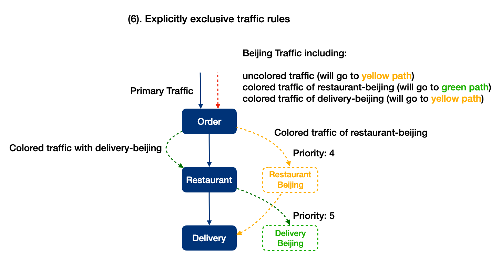

# Multiple Canaries Guide

- [Multiple Canaries Guide](#multiple-canaries-guide)
  - [Background](#background)
  - [Local Canary](#local-canary)
  - [Global Canary](#global-canary)
  - [Practical Guide](#practical-guide)
    - [Explicitly Exclusive Traffic Rules](#explicitly-exclusive-traffic-rules)
    - [Choose Zero or One Canary](#choose-zero-or-one-canary)
  - [FAQ](#faq)

## Background

Canary deployment normally aims to test new features of services with a specific part of the traffic in the production environment. And the feature will be evaluated in multi-dimensions such as online errors, performance or business feedback from users, etc.

In the concept, the canary sounds simple, but in the real world, we often need to handle more complicated things, for example:

- Test and choose one decision from multiple candidates of new features, which means that multiple canaries are running for one service technically.
- Simultaneously, a service has multiple canaries testing for different features.
- The situations above expanded across multiple services.

In a simple summary, we need to explicitly handle how to run multiple canaries in one or more services, and constitute the relationship among them.

## Local Canary

First of all, we start with the simplest situation named `local canary`: If a feature only needs one service to deploy a canary, then we call this canary `local canary`. Please notice there could be many `local canary` at the same time, even within one service. So we could make a definition: `local canary` is the feature only requiring one service to deploy canary.

The local canary itself is very simple, but when it comes to the relationship between them we need to be careful. So we will use an evolutionary way to illustrate its points.

As the basic example at (1), we have 3 services to represent backend services of an order takeaway app, and primary traffic means all traffic except canary traffic:


Then at (2), `team-delivery` deployed a local canary `delivery-beijing` to test a new feature for traffic from Beijing.


And we go to (3), another team `team-restaurant` deployed another local canary `restaurant-beijing` to test another new feature. So if the two canaries handled some or all common traffic, the clients might get unexpected results. For example, `restaurant-beijing` returned a cook duration but `delivery-beijing` returned a delivery duration, where the sum of two separated durations is not consistent with the original total duration. This kind of confusing situation isn’t absolutely what we want to appear.


So the situation illustrated (4) is what we expect in normal scenarios. We need to explicitly split Beijing traffic into two parts respectively going through two different canaries. There are different solutions in different environments, we will demonstrate one later.


As the evolution shows, we can tell it’s unsafe that local canaries share some part of traffic. In other words technically: Local canaries do not call each other.

## Global Canary

Based on local canary, the term global canary is pretty clear, it is for the feature that needs multiple services to respectively deploy one release to support one canary. So we need global canary to:

- Test a feature involving multiple services.
- Transfer traffic through service instances which belongs to the same global canary.

Along with the local canary example, we evolve it with global canary:


The principles of global canary evolved from local canary is almost the same: It can’t share traffic with other local or global canaries. But as a global canary, it needs one more principle: It needs to call the same global release of another service if there is, otherwise the primary release can be just the choice. If the traffic choice violates the principles, it can’t get the whole part of the feature, or even it could get unsafe behavior.

When we reach here, we can tell clearly: **Local canary is just a special case of global canary**. So we can conclude 3 core principles here for multiple canary deployments:

1. The traffic rules of choosing the canary are explicitly exclusive.
2. The complete chain of a request goes one canary at most.
3. Normal traffic not matching canary rules must go through primary deployments.

## Practical Guide

Before jumping into the practice, we should define terms to make the words more fluent.

- Color: we use the word to refer to give a request a specific tag, which also means the canary it belongs to under the context.

### Explicitly Exclusive Traffic Rules

To satisfy this goal, we just need to color plain/uncolored traffic in the endpoint under dedicated rules. For example, we use priority as an integer to represent the coloring order, where the number is lower, the priority is higher. So back to the local canary example, we assigned priority 4 to `restaurant-beijing`, 5 to `delivery-beijing`. So the default choice of Beijing traffic will be `restaurant-beijing`. Besides the so-called default choice, if the traffic itself has been already colored in advance, it will go its own canary regardless of the traffic rules.



We suspect you will ask what if they got the same priority, the solution for it could be varied. You can forbid assigning the same priority, or give canaries under the same priority a second level explicit order such as ordering alphabetically.

### Choose Zero or One Canary

based on the practice above, we could just need to guarantee the traffic can’t be recolored in the whole path, which means its color can only be initialized but not changed. For example, if we used an HTTP header `X-Canary-Choice` to represent the color. Every endpoint in the chain must not change its value if there already has been one.

So until now, we could write a simple snippet of pseudocode to explain it in a technical way:

```go
canary := request.Headers[“X-Canary-Choice”]

if canary != “” {
    sendRequestToCanary(request, canary)
} else {
    canary := chooseCanary(request)
    if canary != “” {
        request.Headers[“X-Canary-Choice”] = canary
        sendRequestToCanary(request, request.Canary)
    } else {
        sendRequestToPrimary(request)
    }
}
```

And the complete examples of the alogorithm `chooseCanary` could be like:

|             Traffic             | Delivery Canary Table  (Priority, Traffic Rules, Color)       |      Decision       |                   Strategy                   |
| :-----------------------------: | ------------------------------------------------------------- | :-----------------: | :------------------------------------------: |
|             Beijing             | 1, Beijing, Green 2, Beijing, Blue                            |        Green        |               Base on Priority               |
| Beijing&Android Beijing Android | 1, Beijing, Green 2, Android, Yellow                          | Green Green Yellow  | Base on Priority Base on Rules Base on Rules |
| Beijing&Android Beijing Android | 1, Android, Yellow 2, Beijing&Android, Blue 3, Beijing, Green | Yellow Green Yellow | Base on Priority Base on Rules Base on Rules |

finnally please notice the performance cost in selecting canary while it has many canaries. The administration had better set a limitation number for canaries, such as 5.

## FAQ

- What canary policy should be chosen?

It depends on the real business, the common ways could be:

On percentage: it is the simplest policy, but the inconsistent behavior for users may decrease user experience.
On client devices or geographical region, etc: it is stabler than percentage policy, but not stable as users policy.
On users: it is more complex than the percentage policy, but it has more precise control on testing such as VIP users have higher priority to use the new canary feature.

- Which component is better to color traffic?

The moderate way is to use API gateway (the traffic entry) to support configurable canary coloring rules. It needs an API gateway to easily integrate new features. But as a self-contained solution, every endpoint should have the ability to color traffic in general ways.
