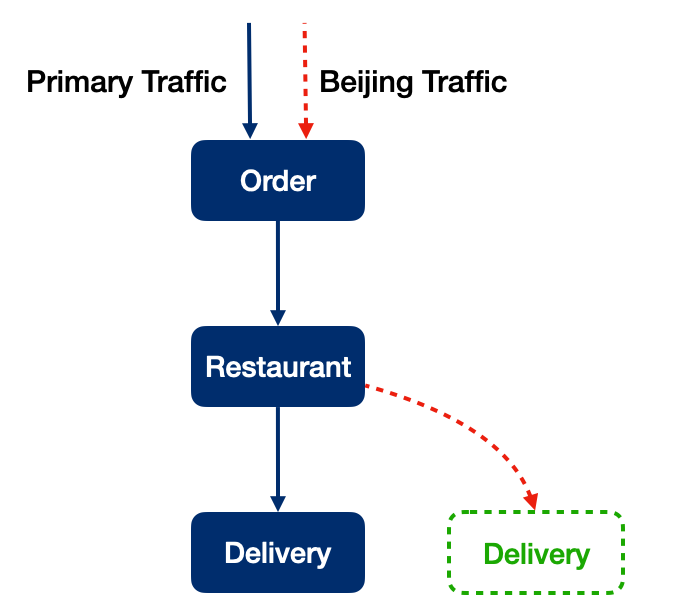
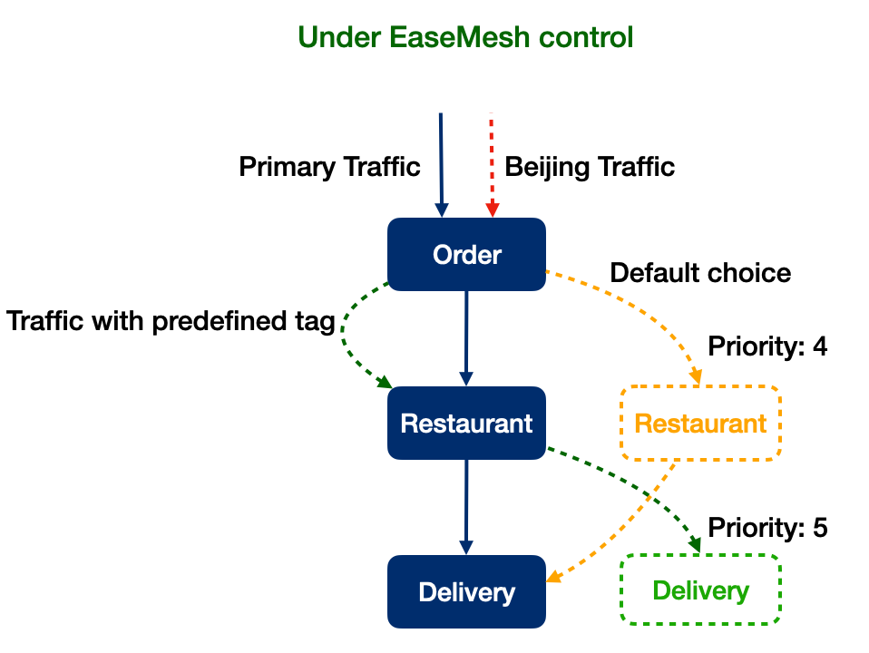
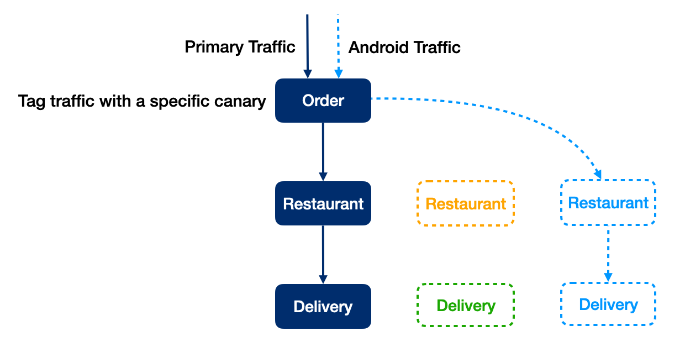

# Service Canary User Manual

- [Service Canary User Manual](#service-canary-user-manual)
  - [Quick Start](#quick-start)
  - [Config Explained](#config-explained)
  - [Another Service Canary](#another-service-canary)
  - [Service Canary Across Multiple Services](#service-canary-across-multiple-services)
  - [Safety](#safety)

EaseMesh uses service canary to define rules of [canary release](https://martinfowler.com/bliki/CanaryRelease.html) for mesh services.

## Quick Start

We use 3 services to present a demonstration of a takeaway app, plus a delivery canary release to add a new feature that returns road duration.



1. Apply takeaway app config:

```bash
$ emctl apply -f https://raw.githubusercontent.com/megaease/easemesh-demo/main/deploy/mesh/easemesh_tenant.yaml
$ emctl apply -f https://raw.githubusercontent.com/megaease/easemesh-demo/main/deploy/mesh/easemesh_order.yaml
$ emctl apply -f https://raw.githubusercontent.com/megaease/easemesh-demo/main/deploy/mesh/easemesh_restaurant.yaml
$ emctl apply -f https://raw.githubusercontent.com/megaease/easemesh-demo/main/deploy/mesh/easemesh_delivery.yaml


$ kubectl apply -f https://raw.githubusercontent.com/megaease/easemesh-demo/main/deploy/mesh/k8s_mesh_namesapce.yaml
$ kubectl apply -f https://raw.githubusercontent.com/megaease/easemesh-demo/main/deploy/mesh/k8s_order.yaml
$ kubectl apply -f https://raw.githubusercontent.com/megaease/easemesh-demo/main/deploy/mesh/k8s_restaurant.yaml
$ kubectl apply -f https://raw.githubusercontent.com/megaease/easemesh-demo/main/deploy/mesh/k8s_delivery.yaml
```

2. Try primary traffic

```bash
# Get order public node port.
$ kubectl get -n mesh-service service order-mesh-public
$ curl http://{node_ip}:{order_public_port}/ -d '{"order_id": "abc1234", "food": "bread"}'
order_id: abc1234
restuarant:
  delivery_time: 2021-12-07T13:12:14
  food: bread
  order_id: abc1234
```

3. Add canary of delivery

```bash
$ emctl apply -f https://raw.githubusercontent.com/megaease/easemesh-demo/main/deploy/mesh/easemesh_delivery_beijing.yaml
$ kubectl apply -f https://raw.githubusercontent.com/megaease/easemesh-demo/main/deploy/mesh/k8s_delivery_beijing.yaml

$ curl http://127.0.0.1:32539/ -d '{"order_id": "abc1234", "food": "bread"}' -H 'X-Location: Beijing'
order_id: abc1234
restuarant:
  delivery_time: '2021-12-07T13:22:47 (road duration: 7m)'
  food: bread
  order_id: abc1234
```

## Config Explained

Actually, We just introduce a new definition to describe service canary in [delivery_beijing.yaml](https://github.com/megaease/easemesh-demo/blob/main/deploy/mesh/easemesh_delivery_beijing.yaml):

```yaml
apiVersion: mesh.megaease.com/v1alpha1
kind: ServiceCanary
metadata:
  name: delivery-mesh-beijing
spec:
  priority: 5 # The range is [1, 9], default is 5, the lower number is, the priority is higher.
  selector:
    matchServices: [delivery-mesh] # What services are in the canary.
    matchInstanceLabels: {release: delivery-mesh-beijing} # What instance labels are in the canary.
  trafficRules: # What characteristics of traffic are in the scope of canary.
    headers:
      X-Location:
        exact: Beijing
```

So this config tells EaseMesh: The traffic with header `X-Location: Beijing` will be tagged `delivery-mesh-beijing`, and it will go through instances labeled `release: delivery-mesh-beijing` of the service `delivery-mesh`.

The details about the config refer to [service canary](https://github.com/megaease/easemesh-api/blob/main/v1alpha1/meshmodel.md#easemesh.v1alpha1.ServiceCanary).

## Another Service Canary



Now we are deploying restaurant canary adding a feature predicting the cook duration, which is also tested for Beijing traffic. But it reuses the same header `X-Location` to identity Beijing traffic. So how EaseMesh handles the conflicts between the two canaries is to use different priorities. [delivery_beijing.yaml](https://github.com/megaease/easemesh-demo/blob/main/deploy/mesh/easemesh_restaurant_beijing.yaml) :

```yaml
apiVersion: mesh.megaease.com/v1alpha1
kind: ServiceCanary
metadata:
  name: restaurant-mesh-beijing
spec:
  priority: 4
  selector:
    matchServices: [restaurant-mesh]
    matchInstanceLabels: {release: restaurant-mesh-beijing}
  trafficRules:
    headers:
      X-Location:
        exact: Beijing
```

The lower number is, the priority is higher. So the traffic from Beijing will be tagged `restaurant-mesh-beijing` instead of `delivery-mesh-beijing`. So if the priority of `restaurant-mesh-beijing` was 6, `delivery-mesh-beijing` will be the one.

Multiple canaries with the same priority will be sorted alphabetically in matching, but the user had better rely on the priority instead of the name in order to get explicit results.

So after understanding the mechanism, we could apply the config:

```bash
$ emctl apply -f https://raw.githubusercontent.com/megaease/easemesh-demo/main/deploy/mesh/easemesh_restaurant_beijing.yaml
$ kubectl apply -f https://raw.githubusercontent.com/megaease/easemesh-demo/main/deploy/mesh/k8s_restaurant_beijing.yaml

$ curl http://127.0.0.1:32539/ -d '{"order_id": "abc1234", "food": "bread"}' -H 'X-Location: Beijing'
order_id: abc1234
restaurant:
  delivery_time: '2021-12-07T15:11:33 (cook duration: 5m)'
  food: bread
  order_id: abc1234
```

Now Beijing traffic will go through the new restaurant canary, which doesn't get mixed with delivery canary without confusion. What if you want it to go through delivery canary, adding the header `X-Mesh-Service-Canary: delivery-mesh-beijing` will get the last result as expected.

## Service Canary Across Multiple Services



So what if delivery and restaurant need to be tested for a new feature together. We prepare a feature that restaurant returns coupon if delivery returns the delivery time is beyond the deadline.

```bash
$ emctl apply -f https://github.com/megaease/easemesh-demo/raw/main/deploy/mesh/easemesh_android.yaml
$ kubectl apply -f https://raw.githubusercontent.com/megaease/easemesh-demo/main/deploy/mesh/k8s_delivery_android.yaml
$ kubectl apply -f https://raw.githubusercontent.com/megaease/easemesh-demo/main/deploy/mesh/k8s_restaurant_android.yaml

curl http://127.0.0.1:32539/ -d '{"order_id": "abc1234", "food": "bread"}' -H 'X-Phone-Os: Android'
order_id: abc1234
restaurant:
  coupon: $5
  delivery_time: 2021-12-07T16:54:01
  food: bread
  order_id: abc1234
```

The config shows it very clearly:

```yaml
apiVersion: mesh.megaease.com/v1alpha1
kind: ServiceCanary
metadata:
  name: refund-android
spec:
  priority: 5
  selector:
    matchServices: [restaurant-mesh, delivery-mesh]
    matchInstanceLabels: {release: refund-android}
  trafficRules:
    headers:
      X-Phone-Os:
        exact: Android
```

## Safety

We formulate some rules to guarantee the safety and clarity of service canary:

1. One request is tagged with one canary at most throughout the full chain (technically header `X-Mesh-Service-Canary` will be only one value, and never change if it's been filled).
2. The tagging rule is defined without any ambiguousness(ordered by priority then name).
