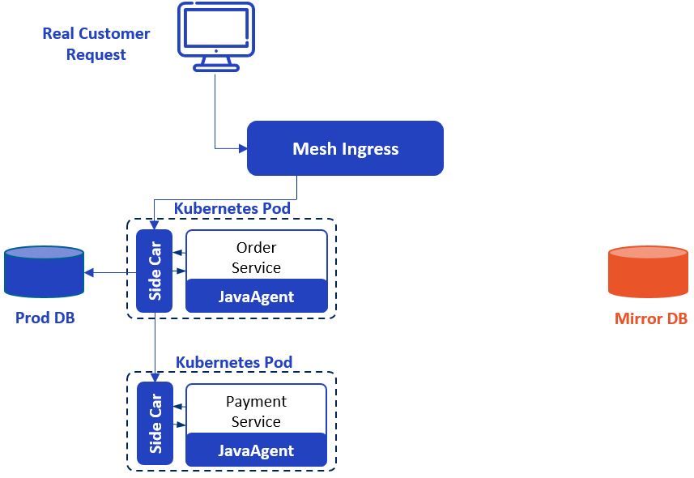

# Full-stack Stress Test With Shadow Service

With the increase of hardware performance, network bandwidth, and user data, traditional stand-alone applications are being replaced by software systems based on the network.

But while bringing more powerful computing capability, such a software system also introduces complexities that were never found in a stand-alone application. Today, a typical software system can include tens to tens of thousands of modules. Moreover, to make the development and deployment process faster, these modules will be developed by different teams in different languages, which also makes the communication between them more complicated.

At the same time, the business logic has also undergone great changes compared with the past, for example, the promotion of Black Friday will make the system bear several times or even dozens of times the daily pressure. As a result, stress testing is becoming increasingly important, but traditional testing methods are also becoming less and less adaptable.

## Issues with a dedicated test environment

Using a 1:1 test environment is a very good stress test method in the stand-alone era, but becomes very impractical in the age of the Internet.

The first issue is cost. To test a stand-alone application, the cost of a dedicated testing computer is affordable for an independent developer in most cases; but today's system requires too many resources, servers, bandwidth, electricity, and server room, the cost of building a 1:1 test environment according to the production environment is beyond the affordability of most companies.

Even if the company is rich enough for building a 1:1 test environment, it is challenging to keep this test environment completely consistent with the production environment.

Because it is a test environment, people will keep deploying the test versions of their modules on it, so developers will inevitably forget to restore the production version after testing their modules, and in the long run, the difference between the test environment and the production environment will become larger and larger, resulting in distorted test results.

Moreover, because the cost is so high, I don't think any company can build such a test environment for each development team, that is, all teams must share the same environment. So, if there's not an excellent coordination mechanism, the tests conducted by different teams will also affect the test results.

Test data is another issue. The test results will not be reliable if the data of the test environment is not close enough to (or even identical with) the production environment. For example, in a Twitter-like system, users like me generally only have a few dozen or hundreds of followers, so it will be fairly easy to notify all my followers in a second when I post a message. But for a celebrity with millions of followers, the situation will be very different. Therefore, we cannot simply use simulated data for testing.

To make the test results reliable, the best way is to import complete production data into the test environment, it looks like an easy job because we can do this by a simple database backup and restore. But there's a lot of sensitive data in the production environment, copying it to the test environment will greatly increase the risk of data leakage.

## Issues with the production environment

As there are many difficulties in using a test environment for stress testing, people turn their eyes to the production environment and try to use the low traffic period of the production environment for testing. But it's also a huge challenge because it is an intrusive solution that involves modifying or even redefining business logic.

As shown in the diagram below, the blue box is the original business logic, and the orange box is the new logic we need to add, which seems to be just a few `if/else`, but they are much more complex in practice.


Assuming the system we need to modify is an online shopping system, the process of shopping and placing orders should involve a series of modules such as `user`, `order`, and `payment`.

When we modify the `user` module, in the diamond box, how can we tell whether we should go to the test logic or the production logic? A common method is to specify a range of user IDs in advance, if it is a user of this range, go to the test logic, and the production logic when otherwise.

After the `user` module, the logic goes to the `order` module, at this time, we may still want to judge whether the test logic should be taken through the user ID. But a more possible situation may be: the user information is discarded by the series of complex processing, that's the `order` module cannot see it.

To distinguish between normal orders and test orders, the `user` module is required to take some additional steps in the orange box, such as adding annotations to the order. However, in a complex system, it is not easy for the `user` module to know all the modules that the subsequent process will go through. So we have to spend a lot of effort to ensure the test state is correctly transmitted between modules to avoid disturbing the production logic. And, we also need to consider things like accessing which dataset, mocking a third-party dependency in the orange box.

Very obviously, the workload required for this modification of business logic is proportional to the number of function points. But in addition to this, the more serious problem is that after the hard work, no one can guarantee that all the changes that need to make have been made and were made correctly, and if it happens, the production data will be corrupted.

## The Solution

As can be seen from the analysis above, a full-stack stress test in a dedicated testing environment is both costly and unreliable, while a test in the production environment is both heavy and risky. Therefore, [MegaEase](https://www.megaease.com) believes that a completely new approach must be taken, and the keys of this approach are `3-consistency` and `4-isolation`.

The `3-consistency` are business consistency, data consistency, and resource consistency. That is to say, the test environment and the production environment should be identical, this is a fundamental requirement for getting a reliable result. Realistically, 100% consistency is not always possible, for example, we usually can't ask a third party to cooperate with us to make a test, and we have to mock the third-party dependency in this case. But we still need to do our best to ensure the consistency of the two environments.

The `4-isolation` are business isolation, data isolation, traffic isolation, and resource isolation. These isolations are all designed to completely separate the production and test environment to avoid their mutual impact. 

Obviously, the `3-consistency` focuses on the reliability of the test result, while the `4-isolation` ensures that the test process does not corrupt the production environment.

Based on these principles, MegaEase implements the `Shadow Service` feature in EaseMesh. By using this feature, users can easily replica all services in the production environment, and except for a `shadow` tag, these replicas are exactly the same as the original service, thus ensuring `business consistency` and `business isolation`. At the same time, `Shadow Service` creates a Canary rule automatically which forwards requests with `X-Mesh-Shadow: shadow` header to the service replica and other requests to the original service for `traffic isolation`.

For `data isolation`, `Shadow Service` can replace the connection information of various middlewares (including MySQL, Kafka, Redis, etc.) according to the configuration, and change the destination of data requests, while users can make a copy of the production data as test data to ensure `data consistency`.

`Resource consistency` and `resource isolation` mean that the test environment should use resources of the same specification as the production environment, but should not share the same set of resources. Resources are regarding hardware in these two phrases, but Kubernetes has given a very good answer at the software level, and EaseMesh is built on top of Kubernetes, so by deploying the replica of the service into a new POD, `resource consistency` and `resource isolation` are guaranteed.

## The usage of shadow service

Now let’s introduce the usage of Shadow Service with a simplified payment scenario, it is involving two services, Order and Payment, the Order service calls the Payment service, the Payment service will eventually call a third-party service (not shown in the figure) to complete the payment, and the Order service also accesses a MySQL database.

The system is deployed into Kubernetes via EaseMesh, during the deployment process, EaseMesh injects SideCar ([Easegress](https://github.com/megaease/easegress)-based) and [JavaAgent](https://github.com/megaease/easeagent) into the application's POD, thereby hijacking the HTTP requests and data requests issued by the application, achieving the `3-consistency` and `4-isolation` we have mentioned earlier. Below is the architecture of the system.


To test it, we need to first create a copy of the database. This step can be done through the backup and recovery function of MySQL. Because both data copies are in the same security domain, it is no need to desensitize the data.



Then, the below `emctl` command will create the shadow copy of the Order service, a Canary rule (created automatically, so not included in the configuration). Note that the database for the Order service is changed to database copy which we have just created.

```bash
echo '
kind: ShadowService
apiVersion: mesh.megaease.com/v1alpla1
metadata:
  name: shadow-user-service
spec:
  serviceName: user-service
  namespace: megaease-mall
  mysql:
    uris: "jdbc:mysql://172.20.2.216:3306/shadow_user_db..."
    userName: "megaease"
    password: "megaease"
' | emctl apply
```


Finally, since we don't want to pay for the test requests, we'll use the following command to mock the Payment service. Note that calling a third-party payment service usually involves several very complex security verification steps, which makes it difficult for this service to be mocked. Therefore, we wrap the third-party service into the internal Payment service to simplify the calling process. The service which was mocked below is the internal service instead of the third-party service.

```bash
echo '
kind: Mock
apiVersion: mesh.megaease.com/v1alpha1
metadata:
  name: payment-service
  registerTenant: megaease-mall
spec:
  enabled: false
  rules:
    - match:
        pathPrefix: /
        headers:
          X-Mesh-Shadow:
            exact: shadow
      code: 200
      headers:
        Content-Type: application/json
      body: '{"result":"succeeded"}'
' | emctl apply
```

This completes the creation of the test system, to which we can send a request with an `X-Mesh-Shadow: shadow` header for stress testing. The final system architecture looks like below.


## Pros of shadow service

Compared to traditional testing methods, stress testing with Shadow Service has clear advantages in the following five areas:
* **Zero code change**: everything is done via configuration, no need to modify any code and lower risks to create new bugs.
* **Low cost**: when using cloud-based servers, the hardware resources used for testing can be applied just before the test and released immediately after the test, you only need to pay for what you need.
* **Business logic is basically the same as the production environment**: Except for a few services that are mocked, the test system is completely consistent with the production system, avoiding inaccuracies caused by differences in business logic to the greatest extent.
* **Test with production data**: The data of the test system and the production system are completely consistent, which ensures the reliability of the test results.
* **Secure**: although production data is used during testing, the test environment and the production environment are in the same security domain, so it doesn't increase the risk of data leakage.
