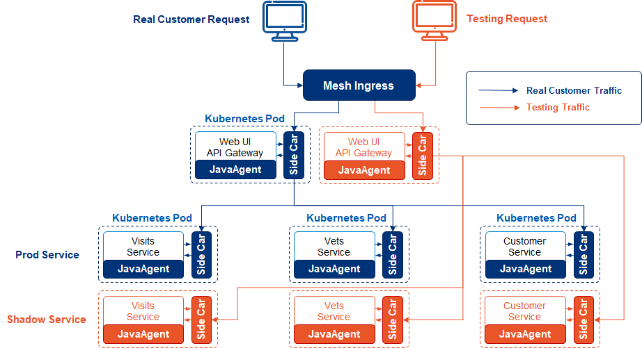
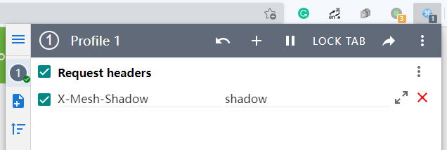

# Shadow Service User Manual

- [Shadow Service User Manual](#shadow-service-user-manual)
  - [Background](#background)
  - [Installation](#installation)
  - [Quick Start](#quick-start)
  - [Override Middleware Configuration](#override-middleware-configuration)
  - [Delete a Shadow Service](#delete-a-shadow-service)

## Background

Shadow service is an add-on feature of EaseMesh, it replicates existing services to a shadow copy, and then, test traffic could be sent to the shadow services for the test.

Microservices allow developers to develop and deploy changes faster, but also bring more complexity and difficulty to the troubleshooting process. Most of the time when something is wrong in a microservices based system, developers don't understand which microservice is the root cause at the beginning, so it will be a great help if they are allowed to send test traffic to the whole system for debugging. But very often, this is not possible in a production system.

Shadow service makes this possible, with a simple configuration, it replicates existing services to a shadow copy, and the shadow copy is identical to the origin copy by default. A canary rule is deployed at the same time to ensure that production traffic is sent to the original copies and test traffic is sent to the shadow copies. This guarantees the consistency of the shadow copies and the original copies to the greatest extent, and the developer could send test traffic to the shadow copies without impacting the production system.

Shadow service also enables full stack stress tests. To keep the system being highly available, developers usually run a performance test on the test environment for the whole system, or on the production environment for a single service. However, the test environment is very different from the production environment, and we can not get the desired result for the whole system from a single service. With the help of shadow service, we could replicate the whole production environment to a shadow copy, and run the stress against it to get the most authentic data.

## Installation

As an add-on feature, shadow service could be installed at the same time as EaseMesh installation with an additional command line flag `--add-ons=ShadowService`, like below:

```bash
emctl install --add-ons=ShadowService
```

Or, if EaseMesh infrastructure has already been installed, the shadow service feature could be installed with the command:

```bash
emctl install --only-add-on --add-ons=ShadowService
```

## Quick Start

Based on the [Spring Pet Clinic](../README.md#71-start-petclinic-in-easemesh) example, we will create shadow services as show in below diagram.



1. **Create Shadow Services**

Apply below YAML spec to EaseMesh with `emctl apply` command, it creates shadow services for all services in the Pet Clinic example.

```yaml
kind: ShadowService
apiVersion: mesh.megaease.com/v1alpla1
metadata:
  name: shadow-api-gateway
spec:
  serviceName: api-gateway
  namespace: spring-petclinic

---

kind: ShadowService
apiVersion: mesh.megaease.com/v1alpla1
metadata:
  name: shadow-customers-service
spec:
  serviceName: customers-service
  namespace: spring-petclinic

---

kind: ShadowService
apiVersion: mesh.megaease.com/v1alpla1
metadata:
  name: shadow-visits-service
spec:
  serviceName: visits-service
  namespace: spring-petclinic

---

kind: ShadowService
apiVersion: mesh.megaease.com/v1alpla1
metadata:
  name: shadow-vets-service
spec:
  serviceName: vets-service
  namespace: spring-petclinic
```

2. **Send Colored Traffic**

Install the [ModHeader Extension](https://chrome.google.com/webstore/detail/modheader/idgpnmonknjnojddfkpgkljpfnnfcklj?hl=en) to your Chrome browser, and then set header `X-Mesh-Shadow` with value `shadow`.



Access the Pet Clinic website, make some changes, then turn off the `X-Mesh-Shadow` header and refresh the page, we can find the changes we just made disappear; turn on the `X-Mesh-Shadow` header, we can see the changes again.

## Override Middleware Configuration

By default, the Pet Clinic application uses an in-memory database, that's when we create a shadow copy of the services, a new database copy is created at the same time, so changes made from the shadow services are invisible from the original services.

But if Pet Clinic was configured to use an external MySQL database, changes made from both service copies will be written into the same database, and because shadow services are created for the testing purpose, this is not what we want.

Shadow service provide a way to override the database connection configuration. For example, we can direct the `shadow-customers-service` to use another database as below:

```yaml
kind: ShadowService
apiVersion: mesh.megaease.com/v1alpla1
metadata:
  name: shadow-customers-service
spec:
  serviceName: customers-service
  namespace: spring-petclinic
  mysql: # +
    uris: "jdbc:mysql://172.20.2.216:3306/shadow_db?allowPublicKeyRetrieval=true&useUnicode=true&characterEncoding=utf-8&useSSL=false&serverTimezone=UTC&verifyServerCertificate=false" # +
    userName: "megaease" # +
    password: "megaease" # +
```

Besides MySQL, shadow service supports overriding configuration for the following middlewares: Kafka, Redis, RabbitMQ, and Elastic Search.

## Delete a Shadow Service

To delete a shadow service instance, use the command `emctl delete ShadowService`, for example:

```
emctl delete ShadowService shadow-customers-service
```
