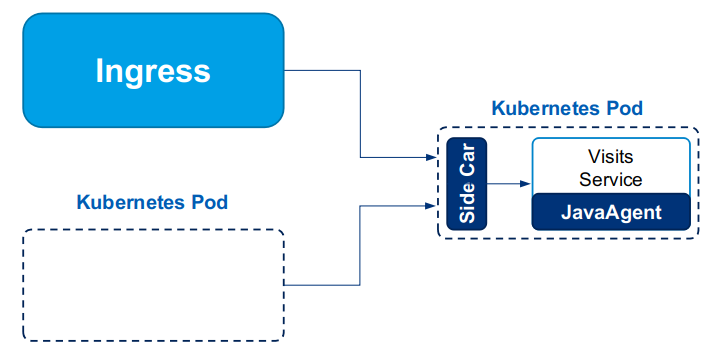
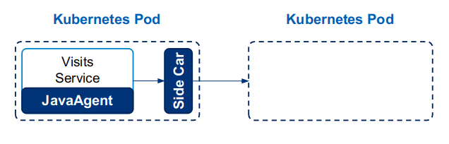

# EaseMesh Manual

- [EaseMesh Manual](#easemesh-manual)
  - [Introduction](#introduction)
  - [Installation](#installation)
  - [Client command tool](#client-command-tool)
  - [Admin](#admin)
  - [Mesh service](#mesh-service)
    - [Tenant Spec](#tenant-spec)
    - [MeshService Spec](#meshservice-spec)
  - [Native Deployment](#native-deployment)
    - [Create a specific (interested) namespace](#create-a-specific-interested-namespace)
    - [Deploy an annotated deployment](#deploy-an-annotated-deployment)
  - [MeshDeployment](#meshdeployment)
  - [Sidecar Traffic](#sidecar-traffic)
    - [Inbound](#inbound)
    - [Outbound](#outbound)
      - [Load balance](#load-balance)
      - [Traffic split](#traffic-split)
    - [Sidecar Configuration](#sidecar-configuration)
  - [Resilience](#resilience)
    - [CircuitBreaker](#circuitbreaker)
    - [RateLimiter](#ratelimiter)
    - [Retryer](#retryer)
    - [TimeLimiter](#timelimiter)
  - [Observability](#observability)
    - [Tracing](#tracing)
      - [Turn-on tracing](#turn-on-tracing)
      - [Turn-off tracing](#turn-off-tracing)
    - [Metrics](#metrics)
      - [Turn-on metrics reporting](#turn-on-metrics-reporting)
      - [Turn-off metrics reporting](#turn-off-metrics-reporting)
    - [Log](#log)
      - [Turn-on Log](#turn-on-log)
      - [Turn-off Log](#turn-off-log)
  - [Traffic Control](#traffic-control)
    - [Traffic Group](#traffic-group)
    - [Traffic Target](#traffic-target)


## Introduction

 EaseMesh divides the main components into two parts, one is **Control plane**, the other is **Data plane**. In the control plane, EaseMesh uses the Easegress cluster to form a reliable decision delivery and persistence unit. The data plane is composed of each mesh service with the user's business logic and EaseMesh's enhancement units, including EaseAgent and Easegress-sidecar. And there is also a Mesh Ingress unit for routing and handling South-North way traffic.


## Installation

Please check out [install.md](./install.md) to install the EaseMesh.

## Client command tool

The client command tool of the EaseMesh is `emctl`, please checkout [emctl.md](./emctl.md) for usages.

## Admin

We implement the object `MeshController` running upon Easegress. The spec of MeshController could affect the general behavior of  control plane. We could use `emctl apply` to update it, and its complete example and explanation would be:

```yaml
apiVersion: mesh.megaease.com/v2alpha1
kind: MeshController
metadata:
  name: easemesh-controller
# HeartbeatInterval is the interval for one service instance reporting its heartbeat.
heartbeatInterval: 5s
# RegistryType indicates which protocol the registry center accepts.
registryType: consul
# APIPort is the port for worker's API server.
apiPort: 13009
# IngressPort is the port for http server in mesh ingress.
ingressPort: 19527
# External service registry name.
externalServiceRegistry:
# Clean old external registry data.
cleanExternalRegistry: true

security:
  mtlsMode: permissive # Support permissive, strict
  certProvider: selfSign # Only support selfSign
  rootCertTTL: 48h
  appCertTTL: 24h # Must be less than or equal to rootCertTTL

# Sidecar injection stuff, the values here are default ones
imageRegistryURL: docker.io
imagePullPolicy: IfNotPresent
sidecarImageName: megaease/easegress:server-sidecar
agentInitializerImageName: megaease/easeagent-initializer:latest
log4jConfigName: log4j2.xml
```

## Mesh service

Services are the first-class citizens of the EaseMesh. Developers need to breakdown their business logic into small units and implement it as services.

Different from K8s service, the EaseMesh manages application by the service, a service has a logic name that is related to one or multiple K8s deployments. The service has its [own specification ](#mesh-service) and must belong to a [tenant](#tenant-spec).

A service could have co-exist multiple versions, a version of the service is a [MeshDeployment](#meshdeployment) or [native K8s deployment](#deploy-an-annotated-deployment) which binds to Kubernetes Deployment resource.


### Tenant Spec
The `tenant` is used to group several services of the same business domain. Services can communicate with each other in the same tenant. In EaseMesh, there is a special global tenant that is visible to the entire mesh. Users can put some global, shared services in this special tenant.

> ** Note: **
> All specs in the EaseMesh are written in Yaml formation

**Create a tenant for services** You can choose to deploy a new mesh service in an existing tenant, or creating a new one for it. Modify example YAML content below and apply it:


```yaml
name: ${your-tenant-name}
description: "This is a test tenant for EaseMesh demoing"
```

> Please remember to change the YAML's placeholders such as ${your-tenant-name} to your real service name before applying.
>Tenant Spec reference: https://github.com/megaease/easemesh-api/blob/master/v1alpha1/meshmodel.md#easemesh.v1alpha1.Tenant

### MeshService Spec

**Create a service and specify which tenant the service belonged to**. Creating your mesh service in EaseMesh. Note, we only need to add this new service's logic entity now. The actual business logic and the way to deploy will be introduced later. Modify example YAML content below and apply it


```yaml
name: ${your-service-name}
registerTenant: ${your-tenant-name}
loadBalance:
  policy: roundRobin
  HeaderHashKey:
sidecar:
  discoveryType: eureka
  address: "127.0.0.1"
  ingressPort: 13001
  ingressProtocol: http
  egressPort: 13002
  egressProtocol: http
```

>Service Spec Reference: https://github.com/megaease/easemesh-api/blob/master/v1alpha1/meshmodel.md#easemesh.v1alpha1.Service

 Now we have a new tenant and a new mesh service.  They are both logic units without actual processing entities.

For service register/discovery, EaseMesh supports three mainstream solutions, Eureka/Consul/Nacos. Check out the corresponding configuration URL below:

| Name   | URL In Mesh deployment configuration |
| ------ | ------------------------------------ |
| Eureka | http://127.0.0.1:13009/mesh/eureka   |
| Consul | http://127.0.0.1:13009               |
| Nacos  | http://127.0.0.1:13009/nacos/v1      |

Communications between internal mesh services can be done through Spring Cloud's recommended clients, such as `WebClient`, `RestTemplate`, and `FeignClient`. The original HTTP domain-based RPC remains unchanged. Please notice, EaseMesh will host the Ease-West way traffic by its mesh service name, so it is necessary to keep the mesh service name the same as the original Spring Cloud application name for HTTP domain-based RPC.


## Native Deployment

Except for the custom resource [MeshDeployment](#meshdeployment), we support the native K8s deployment resource to automatically inject the JavaAgent and sidecar.

If you want the EaseMesh to govern applications, you need to fulfill the following prerequisites:
1. Create the namespace with the specified label.
2. Annotated the deployment spec with specific annotations.
3. Deploy applications via the K8s Deployments.

### Create a specific (interested) namespace
The EaseMesh only watches the create/update operation that occurred in the interested namespace. What's is the interested namespace, it's a namespace label with a specific key. So if you want the EaseMesh to automatically inject the sidecar and the JavaAgent for the Deployment in the namespace, you need to create the namespace with the label key: `mesh.megaease.com/mesh-service`

For example:
```yaml
apiVersion: v1
kind: Namespace
metadata:
  name: spring-petclinic
  labels:
    mesh.megaease.com/mesh-service: "true"
```
> No matter what's the value of the `mesh.megaease.com/mesh-service` is set, EaseMesh will regard the namespace as the interested namespace in which deployments create/updated will be instrumented.

### Deploy an annotated deployment

As mentioned before,  the EaseMesh will instrument the deployments create/update operation in the specified namespace, but the EaseMesh's injection will not be always applied on all deployments in the namespace, it will only influent the deployment annotated with specified annotation.

The EaseMesh provides the following annotations to users which will help the EaseMesh efficiently manage users' applications:

- `mesh.megaease.com/service-name`: *Required annotation*, it is the name of [MeshService](#mesh-service).
- `mesh.megaease.com/service-labels`: *Optional annotation*, if you need a canary version of applications, you could specify it via a "key=value" form. These labels will be attached to instances registered in the service registry.
- `mesh.megaease.com/app-container-name`: *Optional annotation*, If your deployments contain multiple containers, you need to specify what's container is your app container. If it is omitted, the EaseMesh assumes the first container is the application container.
- `mesh.megaease.com/application-port`: *Optional annotation*, If the application container listens on multiple ports, you must specify a port as an application port from which services are provided. If it is omitted, the first port is regarded as an application port.
- `mesh.megaease.com/alive-probe-url`: *Optional annotation*, The sidecar needs to know whether the application container is alive or dead. If it is omitted, the default is:`http://localhost:9900/health`, The JavaAgent will open the port to listen.
- `mesh.megaease.com/init-container-image`: *Optional annotation*, the image name of the initContainer which contains the JavaAgent jar providing the observability to the service. if omitted, the default initContainer image  will use.
- `mesh.megaease.com/sidecar-image`: *Optional annotation*, the sidecar image for controlling the service traffic. If omitted, the default sidecar image will be used.


For example:
```yaml
apiVersion: apps/v1
kind: Deployment
metadata:
  namespace: ${your-ns-name}
  name: ${your_service-name}-canary
  annotations:
    mesh.megaease.com/service-name: ${your_service-name}
spec:
  replicas: 0
  selector:
    matchLabels:
      app: app1    #Note! service name should remain the same with the origin mesh service
  template:
    metadata:
      labels:
        app: app1
    spec:
      containers:
...
```

## MeshDeployment

> This Feature has been DELETED since v2.0.0.

> It will deprecated in version 1.4.0. We do not encourage to use it. Prefer to using with native deployment with dedicated annotation, refer to [Native deployment](#native-deployment).

EaseMesh relies on Kubernetes for managing service instances and the resources they require. For example, we can scale the number of instances with the help of Kubernetes. In fact, EaseMesh uses a mechanism called [Kubernetes  Custom Resource Define(CRD)](https://kubernetes.io/docs/concepts/extend-kubernetes/api-extension/custom-resources/) to combine the service metadata used by EaseMesh and Kubernetes original deployment. MeshDeployment can be used not only to deploy and manage service instances, it can also help us implement the canary deployment.

MeshDeployment wraps native K8s [Deployment](https://kubernetes.io/docs/concepts/workloads/controllers/deployment) resources. The contents of `spec.deploy` section in the MeshDeployment spec is fully K8s deployments spec definition.

```yaml
apiVersion: mesh.megaease.com/v1beta1
kind: MeshDeployment
metadata:
  namespace: ${your-ns-name}
  name: ${your_service-name}-canary
spec:
  service:
    name: ${your-service-name}
    labels:
      version: canary       # These map is used to label these canary instances
  deploy:                   # K8s native deployment spec contents
    replicas: 2
    selector:
      matchLabels:
        app: ${your-service-name}   #Note! service name should remain the same with the origin mesh service
    template:
      metadata:
        labels:
          app: ${your-service-name}
      spec:
        containers:
...
```

## Sidecar Traffic

In `EaseMesh`, we use `EaseMeshController` based on `Easegress` to play the `Sidecar` role. As a sidecar, the mesh controller will handle inbound and outbound traffic. The inbound traffic means business traffic from outside to sidecar, and the outbound traffic means business traffic from sidecar to outside. We make them clean by the simple diagram:

**InBound Traffic**



### Inbound
MeshController will create a dedicated pipeline to handle inbound traffic:
1. Accept business traffic from outside in one port.
2. Use RateLimiter (See below) to do rate limiting.
3. Transport traffic to the service.


**OutBound Traffic**



### Outbound
MeshController will create dedicated pipelines to handle outbound traffic:
1. Accept business traffic from service in one port.
2. Use CircuitBreaker, Retryer, TimeLimiter to do protection for receiving services according to their own config.
3. Use load balance to choose the service instance.
4. Transport traffic to the chosen service instance.

> The diagram above is a logical direction of the **request** of traffic, the responses flow in the opposite direction which is the same category with corresponding requests.

Please notice the sidecar only handle business request traffic, which means it doesn't hijack traffic to:
1. Middleware, such as Redis, Kafka, Mysql, etc.
2. Any other control plane, such as the `Istio` pilot.

But we are well compatible with the Java ecosystem, so we adapt the mainstream service discovery registry like Eureka, Nacos, and Consul. We do hijack traffic to the service discovery, so it's required that the service **changes service registry address to sidecar address** in the startup-config.

#### Load balance

Load balance defines the service traffic intended policy that is how to schedule traffic between instance of the service. The spec can be omitted, the EaseMesh chose the RoundRobin as the default policy.

> Load balance spec reference: https://github.com/megaease/easemesh-api/blob/master/v1alpha1/meshmodel.md#loadbalance

#### Traffic split

The canary deployment is a pattern for rolling out releases to a subset of servers. The idea is to first deploy the change to a small subset of servers, test it with real users' traffic, and then roll the change out to the rest of the servers. The canary deployment serves as an early warning indicator with less impact on downtime: if the canary deployment fails, the rest of the servers aren't impacted. In order to be safer, we can divide traffic into two kinds, normal traffic, and colored traffic. Only the colored traffic will be routed to the canary instance. The traffic can be colored with the users' model, then setting into standard HTTP header fields.


Preparing new business logic with a new application image. Adding a new `MeshDeployment`, we would like to separate the original mesh server's instances from the new canary instances by labeling `version: canary` to canary instances. Modify example YAML content below and apply it


When canary instances are ready for work, it's time to set the policy for traffic-matching. In this example, we would like to color traffic for the canary instance with HTTP header filed `X-Mesh-Canary: lv1` (Note, we want exact matching here, can be set to a Regular Expression) and all mesh service's APIs are the canary targets. Modify example canary rule YAML content below and apply it

```yaml
canary:
  canaryRules:
  - serviceInstanceLabels:
      version: canary   # The canary instances must have this `version: canary` label.
    headers:
        X-Mesh-Canary:
          exact: lv1    # The colored traffic with this exact matching HTTP header value.
    urls:
      - methods: ["GET","POST","PUT","DELETE"]
        url:
          prefix: "/"  # Routing colored traffic to canary instances all HTTP APIs.

```

> CanaryRule spec reference: https://github.com/megaease/easemesh-api/blob/master/v1alpha1/meshmodel.md#easemesh.v1alpha1.CanaryRule


4. Visiting your mesh service with and without HTTP header `X-Mesh-Canary: lv1`, the colored traffic will be handled by canary instances.


### Sidecar Configuration
* **Note: Please remember to change the YAML's placeholders to your real service name tenant name.**

```yaml
name: ${your-service-name}
registerTenant: ${your-tenant-name}
loadBalance:
  policy: roundRobin
sidecar:
  discoveryType: eureka
  address: "127.0.0.1"
  # Inbound traffic: OtherServices/Gateway -> Sidecar(http://127.0.0.1:13001) -> Service
  ingressPort: 13001
  ingressProtocol: http
  # Outbound traffic: Service -> Sidecar(http://127.0.0.1:13002) -> OtherServices
  # The OtherServices means multiple service instances under roundRobin policy.
  egressPort: 13002
  egressProtocol: http
```
> Sidecar Spec reference :https://github.com/megaease/easemesh-api/blob/master/v1alpha1/meshmodel.md#easemesh.v1alpha1.Sidecar

## Resilience

We borrow the core concept of the mature JAVA fault tolerate library [resilience4j](https://resilience4j.readme.io/) to implement the resilience. With the pipeline-filter(plugin) model of Easegress, We can assemble any of them together. Besides the function of each protection, we must know which side the protection takes effect in the Mesh scenario. We use the 2 clean terms: **sender** and **receiver** (of the request).

- sender: In general sender is a client which shots requests to the server
- receiver: In general receiver is a server that receives requests


### CircuitBreaker

In Mesh, `CircuitBreaker` takes effect in **sender** side, in another word, it applies on outbound traffic. For example,

```yaml
name: ${your-service-name}
registerTenant: ${your-tenant-name}
resilience:
  circuitBreaker:
    policies:
      - name: count-based-example
        slidingWindowType: COUNT_BASED
        failureRateThreshold: 50
        slidingWindowSize: 100
        failureStatusCodes: [500, 503, 504]
    urls:
      - methods: [GET]
        url:
        prefix: /service-b/
        policyRef: count-based-example
      - methods: [GET, POST]
        url:
        prefix: /service-c/
        policyRef: count-based-example
```

> CircuitBreaker Spec reference: https://github.com/megaease/easemesh-api/blob/master/v1alpha1/meshmodel.md#easemesh.v1alpha1.CircuitBreaker

The `sender` is `${your-service-name}`, `receiver`  side contains `service-b`  and `service-c`. So the circuit-breaker takes effect in `${your-service-name}`, and all responses from both `service-b` and `service-c` count to one circuit breaker here. Of course if the items of `urls` reference to different policies, the counting process will be in the respective circuit-breaker.

### RateLimiter

In Mesh, `RateLimiter` takes effect in `receiver` side, in another word, it applies on inbound traffic. For example:

```yaml
name: ${your-service-name}
registerTenant: ${your-tenant-name}
resilience:
  policies:
    - name: policy-example
      timeoutDuration: 100ms
      limitRefreshPeriod: 10ms
      limitForPeriod: 50
      defaultPolicyRef: policy-example
  urls:
    - methods: [GET, POST, PUT, DELETE]
      url:
        regex: ^/pets/\d+$
      policyRef: policy-example
```

> RateLimiter Spec reference :https://github.com/megaease/easemesh-api/blob/master/v1alpha1/meshmodel.md#easemesh.v1alpha1.RateLimiter

So all inbound traffic of `${your-service-name}` will be rate-limited by it, when the traffic character matches the policy. Please notice outbound traffic **from** `${your-service-name}` has no relationship with the rate limiter.

### Retryer

In Mesh, `Retry` takes effect in `sender` side, in another word, it applies on outbound traffic. For example :

```yaml
name: ${your-service-name}
registerTenant: ${your-tenant-name}
policies:
  - name: policy-example
    maxAttempts: 3
    waitDuration: 500ms
    failureStatusCodes: [500, 503, 504]
    defaultPolicyRef: policy-example
  urls:
    - methods: [GET, POST, PUT, DELETE]
      url:
        prefix: /books/
      policyRef: policy-example
```

> Retryer Spec reference: https://github.com/megaease/easemesh-api/blob/master/v1alpha1/meshmodel.md#easemesh.v1alpha1.Retryer

All matching outbound traffic **from** `${your-service-name}` will be retried if the response code is one of `500`, `503`, and `504`.

### TimeLimiter
In Mesh, `TimeLimiter` takes effect in `sender` side. For example:

```yaml
name: ${your-service-name}
registerTenant: ${your-tenant-name}
urls:
- methods: [POST]
  url:
    exact: /users/1
  timeoutDuration: 500ms
```
> TimeLimiter Spec reference: https://github.com/megaease/easemesh-api/blob/master/v1alpha1/meshmodel.md#easemesh.v1alpha1.TimeLimiter

All matching outbound traffic **from** `${your-service-name}` have a timeout in `500ms`.


## Observability

Observability for micro-services in EaseMesh can be cataloged into three areas, distributed tracing, metrics, and logging. Users can see the details of a request, such as the complete request path,  invocation dependencies, and latency of each sub-requests so that issues can be diagnosed. Metrics can reflect the health level of the system and summarize its state. Logging is used to provide more details based on the requested access for helping resolving issues.

### Tracing
* Tracing is disabled by default in EaseMesh. It can be enabled dynamically during the lifetime of the mesh services. Currently, the EaseMesh follow [OpenZipkin B3 specification](https://github.com/openzipkin/b3-propagation) to supports tracing these kinds of invocation :

| Name           | Description                                                                                                                                                                                                                                                              |
| -------------- | ------------------------------------------------------------------------------------------------------------------------------------------------------------------------------------------------------------------------------------------------------------------------ |
| HTTP based RPC | Information about communication between mesh service via HTTP protocol, such as latency, status code, request path and so on. Currently, EaseMesh supports tracing for `WebClient`, `RestTemplate` and `FeignClient`, the more HTTP RPC libraries will be supported soon |
| JDBC           | Information about MySQL SQL execution latency, statement, results and so on.                                                                                                                                                                                             |
| Redis          | Information about Redis command latency, key, and so on.                                                                                                                                                                                                                 |
| RabbitMQ       | Information about RabbitMQ command latency, topic, routine key and so on.                                                                                                                                                                                                |
| Kafka          | Information about Kafka topics' latency and so on.                                                                                                                                                                                                                       |

* EaseMesh relies on `EaseAgent` for non-intrusive collecting span data, and Kafka to store all collected tracing data.

#### Turn-on tracing

1. Configuring mesh service's `ObservabilityOutputServer` to enable EaseMesh output tracing related data into Kafka. Modify example YAML below, and apply it

```yaml
 outputServer:
  enabled: true
  bootstrapServer: ${your_kafka_host_one}:9093,${your_kafka_host_two}:9093,${your_kafka_host_three}:9093
  timeout: 30000
```
> OutputServer spec reference: https://github.com/megaease/easemesh-api/blob/master/v1alpha1/meshmodel.md#easemesh.v1alpha1.ObservabilityOutputServer

2. Finding the desired enable tracing service protocol in [ObservabilityTracings](https://github.com/megaease/easemesh-api/blob/master/v1alpha1/meshmodel.md#easemesh.v1alpha1.ObservabilityTracings) structure. For example, turning on the switch in `ObservabilityTracings.remoteInvoke`  can record mesh service's HTTP RPC tracing data. Also, EaseMesh allows users to configure how Java Agent should report tracing data, such as the reporting sample rate, reporting thread numbers in JavaAgent, and so on. **Note: the reporting configuration is global inside one mesh service's tracing** . Modify example YAML below and applying it

```yaml
tracings:
  enabled: true              # The global enable switch
  sampleByQPS: 30            # The data above QPS 30 will be ignore
  output:
    enabled: true            # Enabling Kafka reporting
    reportThread: 1          # Using one thread to report in JavaAgent
    topic: log-tracing       # The reporting Kafka topic name
    messageMaxBytes: 999900  #
    queuedMaxSpans: 1000
    queuedMaxSize: 1000000
    messageTimeout: 1000
  request:
    enabled: false
    servicePrefix: httpRequest
  remoteInvoke:
    enabled: true                # Turing on this switch for RPC tracing only
    servicePrefix: remoteInvoke
  kafka:
    enabled: false
    servicePrefix: kafka
  jdbc:
    enabled: false
    servicePrefix: jdbc
  redis:
    enabled: false
    servicePrefix: redis
  rabbit:
    enabled: false
    servicePrefix: rabbit
```

>ObservabilityTracings spec reference: https://github.com/megaease/easemesh-api/blob/master/v1alpha1/meshmodel.md#easemesh.v1alpha1.ObservabilityTracings

4. Tracing data are organized as spans, each span is stored in the backend storage service, which provides online analysis and computing functions. MegaEase provides a sophisticated view to help users rapidly diagnosing problems. Checking the web console for your mesh service's RPC tracing information:


#### Turn-off tracing

1. If you want to disable tracing for one mesh service, then set this mesh service's global [tracing switch](https://github.com/megaease/easemesh-api/blob/master/v1alpha1/meshmodel.md#easemesh.v1alpha1.ObservabilityTracings) to `off`. For example, you can prepare YAML as below and apply it

```yaml
tracings:
  enabled: false             # The global enable switch
  sampleByQPS: 30            # The data above QPS 30 will be ignore
  output:
    enabled: tru

    ......

```

2. For only disabling one tracing feature for one mesh service, find the corresponding section, then turn off its switch is enough. For example, to shut down one mesh service's Redis tracing feature, you can prepare YAML as bellow and apply it

```yaml
tracings:
  enabled: true
  sampleByQPS: 30
  output:
    enabled: true
    reportThread: 1
    topic: log-tracing
    messageMaxBytes: 999900
    queuedMaxSpans: 1000
    queuedMaxSize: 1000000
    messageTimeout: 1000
  request:
    enabled: true
    servicePrefix: httpRequest
  remoteInvoke:
    enabled: true
    servicePrefix: remoteInvoke
  kafka:
    enabled: true
    servicePrefix: kafka
  jdbc:
    enabled: true
    servicePrefix: jdbc
  redis:
    enabled: false               # Turing off this switch for not tracing Redis invocation
    servicePrefix: redis
```


### Metrics

* The EaseMesh leverage [EaseAgent( JavaAgent based on Java Byte buddy technology)](https://github.com/megaease/easeagent) to collect mesh services' application metrics in a non-intrusive way. It will collect the data from a service perspective with very low CPU, memory, I/O resource consumption. The supported metric types including:

* For the metric details for every type, checkout the EaseAgent's [develop-guide.md](https://github.com/megaease/easeagent/blob/master/doc/development-guide.md).

* Here are the metics that EaseMesh already supported:


| Name              | Description                                                                                                                                                                                                                                                                                                 |
| ----------------- | ----------------------------------------------------------------------------------------------------------------------------------------------------------------------------------------------------------------------------------------------------------------------------------------------------------- |
| HTTP request      | The mesh service's HTTP APIs metrics, such as m1/m5/m15 rate(`m1` indicates the The http request executions per second `exponentially-weighted moving average` in last 1 minute ), URL, total counts, error counts, p99(The http-request execution duration in milliseconds for 99% user) and so on.        |
| JDBC Statement    | The mesh service's JDBC statement metrics, such as the signature(used for complete SQL sentence matching), JDBC total count, JDBC m1 rate(The JDBC method executions per second `exponentially-weighted moving average` in last 1 minute.), TopN JDBC M1 error rate, JDBC P99 execution duration and so on. |
| JDBC Connection   | The mesh service's JDBC connection  metrics, such as URL, JDBC Connect total count, JDBC Connect M1 rate, JDBC Connect min execution duration, JDBC Connect min execution duration JDBC Connect P99 execution duration and so on                                                                            |
| JVM Memory        | The mesh service's JVM memory related metrics such as JVM initial memory, JVM used memory, JVM committed memory and JVM max memory.                                                                                                                                                                         |
| JVM GC            | The mesh service's JVM GC related metrics such as JVM Gc time, JVM Gc collection times and JVM Gc times per second.                                                                                                                                                                                         |
| Kafka Client      | The mesh service's Kafka client metics such as (**Note:** this is not the reported target Kafka, the user's application usage's Kafka) topic name, Kafka producer throughput(M1), kafka consumer throughput(M1), producer min execution duration and so on.                                                 |
| RabbitMq Producer | The mesh service's RabbitMQ producer's metics such as rabbit exchange, producer M1 rate, producer P99 execution duration and so on.                                                                                                                                                                         |
| RabbitMq Consumer | The mesh service's RabbitMQ consumer's metics such as rabbit exchange, consumer M1 rate, consumer P99 execution duration and so on.                                                                                                                                                                         |
| Redis             | The mesh service's Redis client's metics such as redis P25 execution duration, redis M1 count, redis P99 execution duration and so on.                                                                                                                                                                      |
| MD5 Dictionary    | The mesh service's JDBC statement's complete SQL sentences and MD5 values.                                                                                                                                                                                                                                  |
#### Turn-on metrics reporting

* EaseMesh also reports the mesh service's Metrics into the Kafka used by Tracing. So you can check out how to enable the output Kafka in the Tracing section.

1. Finding the desired enable metrics type in `ObservabilityMetrics` structure. For example, turning on switch in `ObservabilityMetrics.request`  can report mesh service's HTTP request-related metrics.Modify example YAML below and apply it

```yaml
metrics:
  enabled: true                  # the global metrics reporting switch
  access:
    enabled: false
    interval: 30000
    topic: application-log
  request:
    enabled: true                 # the enable target metrics, HTTP request related
    interval: 30000               # the interval between reporting, million seconds
    topic: application-meter      # the reporting target kafka's topic name
  jdbcStatement:
    enabled: false
    interval: 30000
    topic: application-meter
  jdbcConnection:
    enabled: false
    interval: 30000
    topic: application-meter
  rabbit:
    enabled: false
    interval: 50000
    topic: platform-meter
  kafka:
    enabled: false
    interval: 40000
    topic: platform-meter
  redis:
    enabled: false
    interval: 70000
    topic: platform-meter
  jvmGc:
    enabled: false
    interval: 30000
    topic: platform-meter
  jvmMemory:
    enabled: false
    interval: 30000
    topic: platform-meter
  md5Dictionary:
    enabled: false
    interval: 30000000000
    topic: application-meter
```

> Metrics Spec reference: https://github.com/megaease/easemesh-api/blob/master/v1alpha1/meshmodel.md#easemesh.v1alpha1.ObservabilityMetrics

2. Checking the web console for your mesh service's HTTP request metrics


#### Turn-off metrics reporting

1. If you want to disable metrics reporting for one mesh service, then set this mesh service's global `metrics reporting switch` to `off`. For example prepare YAML as below and apply it

```yaml
metrics:
  enabled: false             # The global enable switch
  access:
    ......

```

2. For only disabling one type of metrics reporting for one mesh service, find the corresponding section, then turn off its switch is enough. For example, to shut down one mesh service's HTTP request metrics reporting, you can prepare YAML as bellow and apply it

```yaml
metrics:
  enabled: true                  # the global metrics reporting switch
  access:
    enabled: false
    interval: 30000
    topic: application-log
  request:
    enabled: false                # the disable target metrics, HTTP request related
    interval: 30000               # the interval between reporting, million seconds
    topic: application-meter      # the reporting target kafka's topic name
    ....
```


### Log
* Access log is also disabled by default in EaseMesh. The access log is used to recording details of HTTP APIs of mesh service been requested.

#### Turn-on Log
* EaseMesh also reports the mesh service's Logs into the Kafka used by Tracing. So you can check out how to enable the output Kafka in the Tracing section.

1. Finding the `access` section in [ObservabilityMetrics](https://github.com/megaease/easemesh-api/blob/master/v1alpha1/meshmodel.md#easemesh.v1alpha1.ObservabilityMetrics) structure. Turning on switch in `ObservabilityMetrics.access`  can enable access logging for mesh service's HTTP APIs. Modify example YAML below and apply it

```yaml
metrics:
  enabled: true                  # the global metrics reporting switch
  access:
    enabled: true                # the enable target metrics, HTTP request related
    interval: 30000              # the interval between reporting, million seconds
    topic: application-log       # the reporting target kafka's topic name
  request:
    enabled: false
    interval: 30000
    topic: application-meter
  jdbcStatement:
    enabled: false
    interval: 30000
    topic: application-meter
  jdbcConnection:
    enabled: false
    interval: 30000
    topic: application-meter
  rabbit:
    enabled: false
    interval: 50000
    topic: platform-meter
  kafka:
    enabled: false
    interval: 40000
    topic: platform-meter
  redis:
    enabled: false
    interval: 70000
    topic: platform-meter
  jvmGc:
    enabled: false
    interval: 30000
    topic: platform-meter
  jvmMemory:
    enabled: false
    interval: 30000
    topic: platform-meter
  md5Dictionary:
    enabled: false
    interval: 30000000000
    topic: application-meter
```

> AccessLog reference: https://github.com/megaease/easemesh-api/blob/master/v1alpha1/meshmodel.md#easemesh.v1alpha1.ObservabilityMetrics

2. Checking the web console for your mesh service's HTTP log


#### Turn-off Log
1. For disabling access logging for one mesh service, find the `access` section, then turn off its switch. For example, to shut down one mesh service's HTTP APIs' logging, you can modify YAML as bellow and apply it

```yaml
metrics:
  enabled: true                  # the global metrics reporting switch
  access:
    enabled: false               # disable this service's logging
    interval: 30000
    topic: application-log
    ....
```

## Traffic Control

Due to services in different tenants can't communicate with each other in default situation, we provide the traffic control to allow the conditional communication. We implement traffic control by following [Service Mesh Interface](https://github.com/servicemeshinterface/smi-spec).

We use `Traffic Group` to group traffic by differnt characteristics, and `Traffic Target` to reference several `Traffic Group` to control the communication traffic between services.

### Traffic Group

Currently, we implement [TrafficGroup of version v1alpha2](https://github.com/servicemeshinterface/smi-spec/blob/main/apis/traffic-specs/v1alpha2/traffic-specs.md). Please notice we don't support TCPRoute for now.

We could use `emctl apply` to create or update the Traffic Group. Here are examples:

```yaml
apiVersion: mesh.megaease.com/v2alpha1
kind: HTTPRouteGroup
metadata:
  name: group-all
matches:
- name: everything
  pathRegex: ".*"
  methods: ["*"]
```

```yaml
apiVersion: mesh.megaease.com/v2alpha1
kind: HTTPRouteGroup
metadata:
  name: group-metrics
matches:
- name: metrics
  pathRegex: "/metrics"
  methods: ["GET"]
```

### Traffic Target

`Traffic Target` use `N:1` model for traffic control, which means it controls traffic from multiple services(sources) to one service (destination).

We could use `emctl apply` to create or update Traffic Control, whose success depends on the existence of referenced Traffic Groups. Here are examples:

```yaml
apiVersion: mesh.megaease.com/v2alpha1
kind: TrafficTarget
metadata:
  name: control-001
spec:
  destination:
    kind: Service
    name: delivery-mesh
  sources:
  - kind: Service
    name: order-mesh
  - kind: Service
    name: restaurant-mesh
  rules:
  - kind: HTTPRouteGroup
    name: group-metrics
    matches:
    - metrics
```
